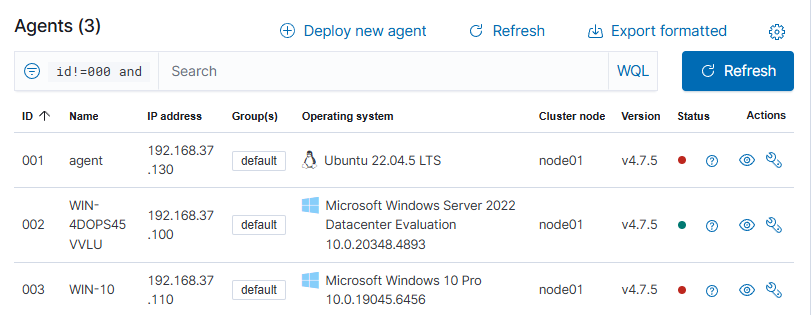

## Objectif

Mettre en place une architecture de supervision et de détection basée sur Wazuh, afin de centraliser les logs d’un environnement Active Directory.

L’objectif est de :

- Déployer un SIEM fonctionnel sur un VPS
- Intégrer des agents sur des machines Windows
- Observer la remontée d’événements de sécurité
- Simuler des attaques et analyser leur détection
- Renforcer la sécurité du serveur (hardening)
- Améliorer la visibilité des actions système via Sysmon

---
## Architecture

- Hôte Windows 11 (hyperviseur / machine locale)
- VPS Ubuntu (Wazuh – SIEM)
- VM Domain Controller (Active Directory)
- VM Windows 10 (Client du domaine)

---
## Installation Wazuh sur VPS

VPS -> Ubuntu 22.04 LTS (compatible avec wazuh)

```bash
curl -sO https://packages.wazuh.com/4.7/wazuh-install.sh
bash wazuh-install.sh -a
```

```bash
You can access the web interface https://<IP_DU_VPS>:443
```

---
## Déploiement des Agents
### Interface web Wazuh (add agent)

- OS : Windows
- IP du manager : **IP VPS Wazuh**

### Installation d'agent sur DC & Windows 10

**Download and install the agent***

```powershell
Invoke-WebRequest -Uri https://packages.wazuh.com/4.x/windows/wazuh-agent-4.7.5-1.msi -OutFile ${env.tmp}\wazuh-agent; msiexec.exe /i ${env.tmp}\wazuh-agent /q WAZUH_MANAGER='IP_DU_VPS' WAZUH_REGISTRATION_SERVER='IP_DU_VPS'
```

**start the agent :**

```powershell
NET START WazuhSvc
```

**Vérification**

![[vérification_agents.png]]



---
## Validation de remontée des logs

**Echec volontaire sur DC**

![[DC_password_incorrect.png]]

**Event sur Wazuh**

Filtres : 
- agent.name is WIN-4DOPS45VVLU
- rule.id is 60122

![[DC_event_wazuh_failed_logon.png]]

**Logon sur WIN-10 (client du DC)**

![[testuser_welcome.png]]

**Event du logon sur Wazuh**

Filtres :
- agent.name is WIN-10  
- rule.id is 60106

![[WIN-10_event_logon_success.png]]

Ces tests permettent de valider la remontée des événements de sécurité vers le SIEM.

---
## Phase d'exposition et observation des menaces

### Tentative de brute force SSH

Le VPS est volontairement laissé en ssh + mdp pour observer le comportement d'internet avant le hardening (à la manière d'un honeypot), on observe :
- tentatives de connexion SSH
- brute force automatisés depuis Internet

![[bruit_sur_le_SIEM.png]]

|Rule ID|Description|Contexte|
|---|---|---|
|5710|Échec SSH (authentification refusée)|Brute force / bots SSH|
|5503|Événement PAM (authentification Linux)|Peut être succès **ou** échec (voir message)|

---
## Hardening du VPS

### SSH (Authentification par clé)

- Passer en authentification SSH par clé uniquement
- Désactiver mot de passe `PasswordAuthentification no`

**Création des clés SSH**

`win+r wsl`

```bash
ssh-keygen -t ed25519 -C "vps-wazuh
```

- `ssh-keygen` → crée une paire de clés SSH
- `-t ed25519` → type de clé (moderne, sécurisé, rapide)
- `-C "vps-wazuh"` → commentaire

**Copie de la clé publique vers VPS**

```bash
ssh-copy-id user@IP_DU_VPS
```

-> ssh login success sans mot de passe

**Désactiver le mot de passe SSH sur le VPS**

```bash
sudo nano /etc/ssh/sshd_config
```

`PasswordAuthentication no`
`PermitRootLogin no`

```bash
sudo systemctl restart ssh
```

❌ Problème : demande toujours un mdp

```bash
sudo grep -R "PasswordAuthentication" /etc/ssh/sshd_config.d

/etc/ssh/sshd_config.d/50-cloud-init.conf:PasswordAuthentication yes

sudo nano /etc/ssh/sshd_config.d/50-cloud-init.conf
```

`PasswordAuthentication no`

```bash
sudo systemctl restart ssh
```

```bash
ssh -v user@IP_DU_VPS
```

✅ Utilise la clé pour s'authentifier

**Avant / Après ssh key**

![[avant_après_sshkey.png]]

**Conclusion**

-> Elimine la majorité des brute force
-> Réduit les logs inutiles

### Mise en place de Fail2ban

**MàJ et installation**

```bash
sudo apt update && sudo apt upgrade -y && sudo apt autoremove -y
```

```bash
sudo apt install fail2ban -y
```

**Activer le service**

```bash
sudo systemctl enable fail2ban
sudo systemctl start fail2ban
sudo systemctl status fail2ban
```

**Vérifier la config**

```bash
sudo fail2ban-client status
Status
|- Number of jail:      1
`- Jail list:   sshd
```

```bash
sudo fail2ban-client status sshd
Status for the jail: sshd
|- Filter
|  |- Currently failed: 1
|  |- Total failed:     9
|  `- File list:        /var/log/auth.log
`- Actions
   |- Currently banned: 1
   |- Total banned:     1
   `- Banned IP list:   2[.]57[.]122[.]177
```

✅ Fail2ban est actif sur :
- `/var/log/auth.log`
- jail `sshd`

**Interprétation**

- `Total failed: 9` → tentatives SSH détectées
- `Currently banned: 1` → une IP bloquée
- `Banned IP` → bot externe Internet

---
## Amélioration de la télémétrie endpoint (Sysmon)

### Installation de Sysmon sur le DC

**Powershell admin**
- créer un dossier de travail

```powershell
mkdir C:\sysmon
cd C:\sysmon
```

**Télécharger Sysmon / extraire**

```powershell
Invoke-WebRequest -Uri https://download.sysinternals.com/files/Sysmon.zip -OutFile Sysmon.zip
```

```powershell
Expand-Archive .\Sysmon.zip -DestinationPath .
```

**Installtion**

```powershell
.\Sysmon64.exe -accepteula -i
```

- `-accepteula` → accepte automatiquement la licence utilisateur (EULA)
- `-i` → installe Sysmon comme service Windows et active la collecte de logs système

**Vérifications**

```powershell
Get-Service Sysmon64

Running
```

```powershell
Get-WinEvent -LogName "Microsoft-Windows-Sysmon/Operational" -MaxEvents 10
```

---
## Simulation d'attaque : reconnaissance Active Directory

Simulation de commandes de reconnaissance sur le contrôleur de domaine afin d'observer leur remontée dans le SIEM.


```powershell
net user
```
- Liste tous les comptes utilisateurs locaux ou du domaine
- Permet d’identifier des cibles potentielles (comptes actifs, noms d’utilisateurs)


```powershell
net localgroup administrators
```
- Affiche les membres du groupe **administrateurs locaux**
- Permet d’identifier les comptes avec privilèges élevés sur la machine


```powershell
net group "Domain Admins" /domain
```
- Liste les membres du groupe **Domain Admins**
- Permet d’identifier les comptes les plus sensibles du domaine

**POV du shell Administrator sur le DC**

![[pov_shell_reconnaissance.png]]

**Remontée des commandes dans le SIEM**

Filtres :
- agent.name is WIN-4DOPS45VVLU
- search sysmon

![[remontée_des_commandes_dans_SIEM.png]]

**Détail de la commande `net group "Domain Admins" /domain`**

![[détail_net_group.png]]

**Conclusion**

Cette simulation permet de mettre en évidence une phase de reconnaissance Active Directory (reconnaissance des utilisateurs et des groupes privilégiés).  
  
Grâce à Sysmon, ces actions sont visibles dans le SIEM avec :  
- le processus exécuté (net.exe)  
- la ligne de commande complète  
- l'utilisateur à l'origine de l'exécution  
- le système cible (DC)
- IP de l'agent concerné

Ces événements sont enrichis par Sysmon et collectés dans Wazuh via le provider `Microsoft-Windows-Sysmon`

![[sysmon_provider.png]]

---
## Conclusion

Ce projet met en place un SIEM avec Wazuh pour centraliser et analyser les logs d’un environnement Windows et Linux.

Il illustre le cycle complet d’un événement de sécurité, de sa génération jusqu’à son analyse dans le SIEM, à travers plusieurs scénarios concrets (authentification, brute force, durcissement et Sysmon).

### Améliorations possibles

- Ajout d’un IDS réseau (Zeek ou Suricata)
- Détection du mouvement latéral (SMB / Active Directory avancé)
- Enrichissement des règles de corrélation Wazuh
- Mise en place de scénarios d’attaque plus réalistes (lateral movement, credential dumping)
- Amélioration des dashboards et alertes

### Ce que j’ai appris

Mise en place et exploitation d’un SIEM, analyse de logs multi-sources, et compréhension concrète de la visibilité des attaques dans un environnement Windows/Linux. J’ai aussi vu comment Sysmon et Fail2ban améliorent la détection et la sécurité globale.

---
## Suite logique

- Mise en place de scénarios d’attaque plus avancés en environnement AD (post-exploitation)
- Simulation de mouvement latéral entre machines du domaine
- Ajout de sources de logs supplémentaires (DNS, proxy, services AD)
- Passage vers une logique de détection orientée “SOC” (corrélation et alertes enrichies)

