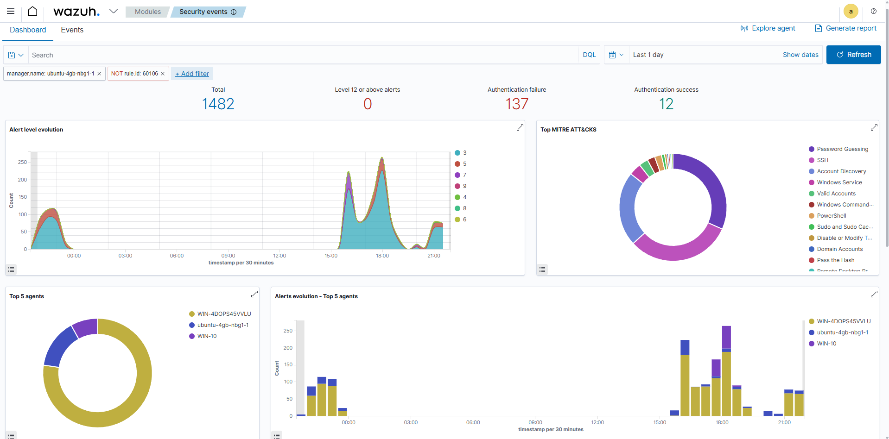

# 🛡️ Lab Wazuh / AD



## 📌 Présentation

Projet de mise en place d’un SIEM (Wazuh) pour centraliser et analyser les logs d’une infrastructure composée d’un Active Directory et de machines Windows/Linux.

## 🎯 Objectifs

- Centraliser les logs système et sécurité
- Détecter des événements suspects (authentification, brute force)
- Améliorer la visibilité des actions sur les machines
- Simuler des scénarios d’attaque en environnement contrôlé

## 🏗️ Architecture
 ```
🖥️ Hôte Windows 11 (Hyperviseur)
        │
        ├── 🧠 VM Domain Controller (Active Directory)
        ├── 💻 VM Windows 10 (Client AD)
        └── 🌐 VPS Ubuntu (Wazuh SIEM)
 ```   
## ⚙️ Fonctionnalités mises en place

- Collecte des logs Windows et Linux
- Détection d’échecs / succès de connexion
- Surveillance des tentatives de brute force SSH
- Amélioration de la télémétrie Windows avec Sysmon
- Durcissement du serveur (SSH + Fail2ban)

## 📊 Résultat

- SIEM fonctionnel et centralisé
- Visibilité sur les événements de sécurité
- Détection de comportements suspects
- Supervision SOC

## 🚀 Conclusion

Mise en place d’un SIEM fonctionnel permettant de comprendre le cycle complet d’un événement de sécurité dans un environnement Active Directory : génération → collecte → analyse → visualisation.

## ⏭️ Suite logique

- Détection de mouvement latéral en Active Directory
- Ajout de nouvelles sources de logs (DNS, proxy, services AD)
- Enrichissement des règles de corrélation Wazuh
